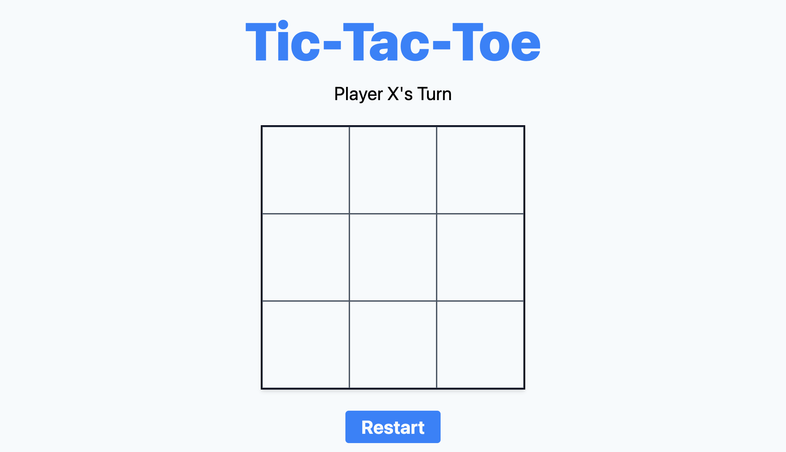
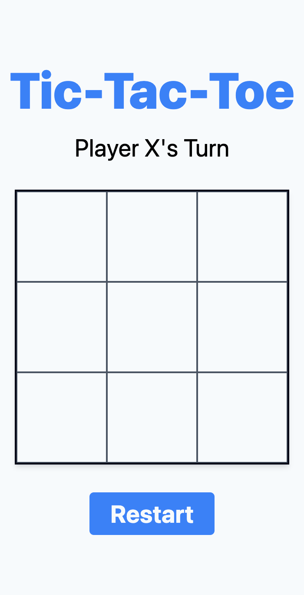

# Tic-Tac-Toe

A tic-tac-toe game made as a project of The Odin Project curriculum. 

Fully responsive.

The game automatically changes players turns, checks for a winner, and can be reset by using the button.

